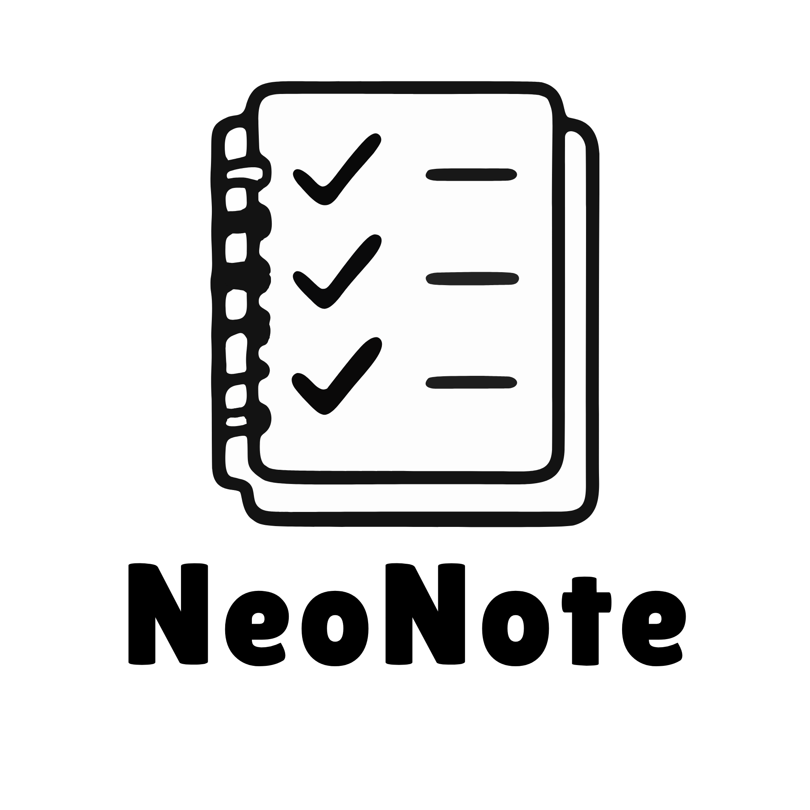

<div align="center">
  

  <h1>NeoNote</h1>

  <p>
    <b>A lightweight, high-performance note-taking application with end-to-end encryption.</b>
  </p>

  <p>
    
    
    
  </p>
</div>

---

## 📱 Preview

<p align="center">
  
</p>

---

## ✨ Features

* 🔐 **Secure by Default**: Full encryption ensures your data remains private.
* 🚀 **Modern UI**: Clean, distraction-free interface for focused writing.
* ⚡ **Fast Performance**: Optimized for speed and low resource usage.
* 📂 **Organized**: Easily manage and categorize your notes.

## 🛠️ Installation

1. **Clone the repository:**
   ```bash
   git clone [https://github.com/xenxaarn/NeoNote.git](https://github.com/xenxaarn/NeoNote.git)
